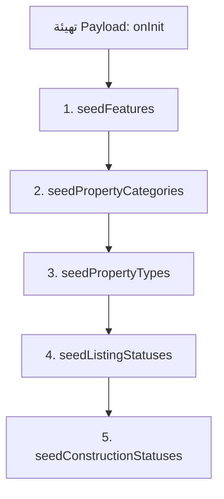

# دليل عملية التسييد (Database Seeding Guide)

في هذا المشروع، تنقسم عملية تسييد البيانات (Database Seeding) إلى قسمين رئيسيين: **التسييد التلقائي (Automatic Seeding)** و**التسييد اليدوي (Manual Seeding)**.

أدناه تفصيل شامل لكل نوع، والملفات المعنية، والترتيب، وكيفية التشغيل.

---

## 1. التسييد التلقائي (Auto-Seeding)

### متى يحدث؟
يحدث التسييد التلقائي **أثناء تشغيل المشروع (Runtime)** وتحديداً عند تهيئة تطبيق Payload CMS (Initialization). 
* **متى يتم تشغيله؟** 
  * عند تشغيل خادم التطوير: `pnpm dev` أو `npm run dev`.
  * عند تشغيل الخادم في الإنتاج: `pnpm start` أو `npm run start`.
  * عند تشغيل أوامر إنشاء الأكواد والأنماط مثل: `pnpm generate:types`.
  * عند تهيئة عميل Payload من خلال أي سكربت خارجي.
* **هل يحدث أثناء البناء (Build)؟**
  لا يتم تشغيل التسييد أثناء مرحلة البناء القياسية `next build` كخطوة مستقلة، ولكن إذا قام خادم Next.js بتهيئة Payload CMS أثناء البناء (مثلاً لإنشاء صفحات ثابتة تعتمد على البيانات)، فإن التسييد سيُنفّذ تلقائياً كجزء من عملية التهيئة.

---

### الترتيب والتفاصيل لملفات التسييد التلقائي
يتم تنظيم التسييد التلقائي واستدعاؤه داخل ملف الإعداد الرئيسي لـ Payload:
* **الملف المسؤول عن التوجيه**: [src/payload.config.ts](file:///f:/new-websites/Fimac-Platform-v2/src/payload.config.ts) داخل دالة العمر `onInit(payload)`.

يتم استدعاء دوال التسييد **بالترتيب التالي** لضمان عدم وجود أخطاء في العلاقات (Relationships) بين الجداول:



#### تفاصيل الملفات وماذا تسيّد:

| الترتيب | اسم الملف ومساره | ماذا يُسيّد؟ (Collection & Data) | شروط التشغيل |
| :---: | :--- | :--- | :--- |
| **1** | [seedFeatures.ts](file:///f:/new-websites/Fimac-Platform-v2/src/db/seedFeatures.ts) | يُسيّد **ميزات العقارات** (Features) في كوليكشن `features`.<br>يحتوي على **39 ميزة افتراضية** (مثل: *WiFi، نظام حماية، مصعد خاص، مسبح...*). | يتم التسييد فقط إذا كان الكوليكشن **فارغاً تماماً** (`totalDocs === 0`). |
| **2** | [seedPropertyCategories.ts](file:///f:/new-websites/Fimac-Platform-v2/src/db/seedPropertyCategories.ts) | يُسيّد **تصنيفات العقارات** الرئيسية في كوليكشن `property-categories`.<br>البيانات: **Residential** (سكني)، **Commercial** (تجاري)، **Hospitality** (ضيافة)، **Land** (أراضي). | يتم التسييد فقط إذا كان الكوليكشن **فارغاً تماماً**. |
| **3** | [seedPropertyTypes.ts](file:///f:/new-websites/Fimac-Platform-v2/src/db/seedPropertyTypes.ts) | يُسيّد **أنواع العقارات التفصيلية** (53 نوعاً) في كوليكشن `property-types` ويربطها بالتصنيفات السابقة.<br>أمثلة: (*Apartment* تحت Residential، *Office* تحت Commercial، *Hotel* تحت Hospitality). | **يعمل دائماً عند التشغيل** (Sync):<br>- إذا كان النوع غير موجود يقوم بإنشائه ويربطه بالتصنيف المناسب.<br>- إذا كان موجوداً، يقوم بتحديثه لضمان مزامنة التصنيفات وملفات المواصفات (Specification Profiles). |
| **4** | [seedListingStatuses.ts](file:///f:/new-websites/Fimac-Platform-v2/src/db/seedListingStatuses.ts) | يُسيّد **حالة عرض العقار** في كوليكشن `listing-statuses`.<br>البيانات: **For Sale** (للبيع)، **Sold** (مُباع)، **Draft** (مسودة). | يدور على الحالات: إذا كانت مفقودة ينشئها، وإذا كانت موجودة بأسماء أو slugs غير دقيقة يقوم بتصحيحها ومزامنتها. |
| **5** | [seedConstructionStatuses.ts](file:///f:/new-websites/Fimac-Platform-v2/src/db/seedConstructionStatuses.ts) | يُسيّد **حالة بناء وإنشاء العقار** في كوليكشن `construction-statuses`.<br>البيانات: **Ready to Move In** (جاهز)، **Under Construction** (تحت الإنشاء)، **Brand New** (جديد أول سكن)، **Off-Plan** (على الخارطة)، **Fully Renovated** (مجدد بالكامل). | يضيف الحالات المفقودة فقط بالاعتماد على الـ `slug`. |

---

### أمر تشغيل التسييد اليدوي
إذا أردت تشغيل التسييد يدوياً في أي وقت، يمكنك تشغيل سكربت التهيئة المستقل:
* **الملف المستدعى**: [scripts/seed-db.ts](file:///f:/new-websites/Fimac-Platform-v2/scripts/seed-db.ts)
* **الأمر**:
  ```bash
  pnpm seed
  ```

---

## 2. التسييد اليدوي للعقارات التجريبية (Properties Seeding Script)

هذا النوع مخصص للمطورين لتعبئة قاعدة البيانات بعقارات كاملة وواقعية (بما في ذلك الصور البصرية، والبيانات الجغرافية، والأسعار، والمواصفات التفصيلية لكل نوع).

### متى يحدث؟
**لا يحدث تلقائياً**. يجب على المطور تشغيله عبر الطرفية (Terminal) بشكل يدوي عند الحاجة (مثلاً بعد تصفير قاعدة البيانات أو عند إعداد البيئة لأول مرة).

### الملف المسؤول وماذا يسيّد؟
* **المسار**: [scripts/seed-properties.ts](file:///f:/new-websites/Fimac-Platform-v2/scripts/seed-properties.ts)
* **ماذا يُسيّد؟**
  1. يتأكد من وجود التصنيفات والحالات والميزات الأساسية في قاعدة البيانات.
  2. يُنشئ مستخدم بائع افتراضي (Seller) لربط العقارات به.
  3. يقوم برفع وتجهيز ملفات الميديا والصور الافتراضية للوحدات وتخزينها في كوليكشن `media`.
  4. يُنشئ **110 عقاراً واقعياً ومفصلاً** موزعة جغرافياً (بين مصر والسعودية)، بحيث يقوم بإنشاء **عقارين (2) لكل نوع** من أنواع العقارات الـ 55 الافتراضية لتغطية واختبار كافة الخصائص والمواصفات المتاحة في المنصة.

### أمر التشغيل:
يمكنك تشغيله من مجلد المشروع الرئيسي باستخدام الأمر التالي:
```bash
npx tsx scripts/seed-properties.ts
```

> [!IMPORTANT]
> يرجى التأكد من ضبط متغيرات البيئة (Environment Variables) في ملف `.env` (مثل `DATABASE_URL` و `PAYLOAD_SECRET`) بشكل صحيح قبل تشغيل أي من أوامر التسييد لضمان الاتصال بقاعدة البيانات بنجاح.
